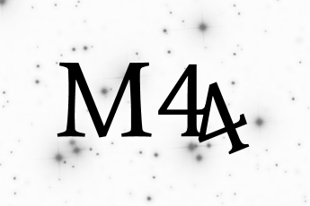

# M44_subcluster
Minor mergers in the Manger

Cool Stars 20 Hack Day project attempting to identify the subcluster in M44 that was identified by Holland et al. (2000)

Contributors:
- Stephanie T. Douglas
- Earl P. Bellinger
- Poshih Chiang
- Martin Nielsen
- Danny M. Krolikowski
- Kim Ward-Duong
